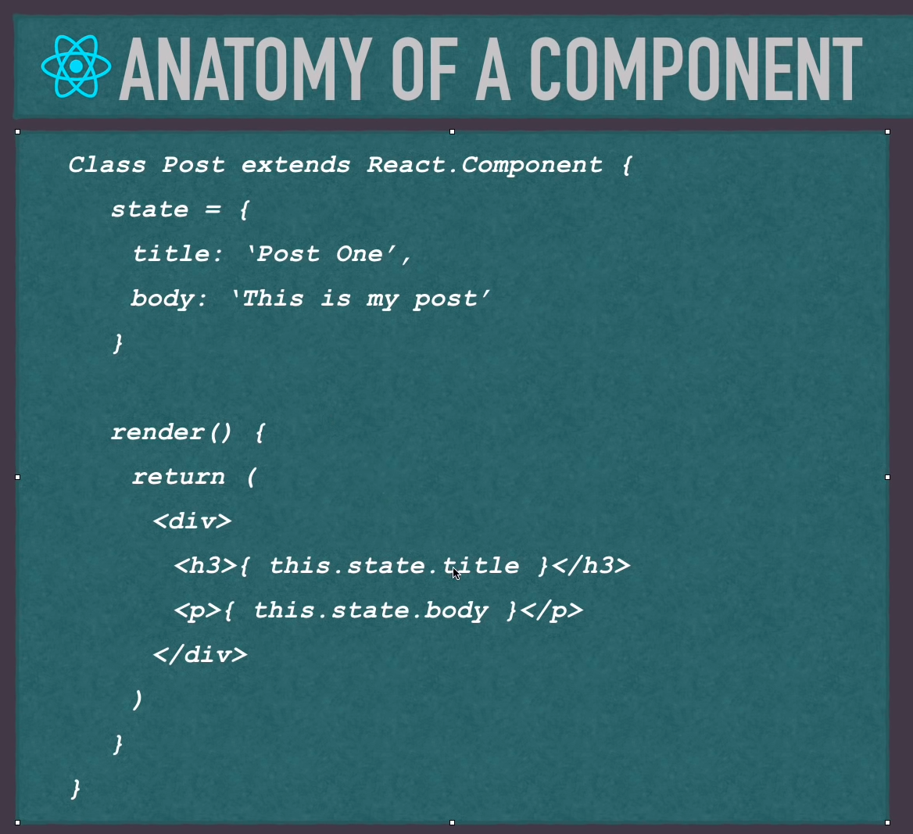

# Basics

Puts everything into a single component. 

- State: Object with values that determines how the component behaves and renders
- Events: Updates state dynamically

- Extends React.Componenet
- render() is a lifecycle methods, the only required method, it returns JSX, very similar to HTML,
we can have **JS expressions embedded there** inside the curly braces, we can have events, etc.




## Project Structure
React is a single web page app, everything runs through one phissicial page:
index.html.
The main app component will be outputted in:
```html
<div id="root"></div>
```


- package.json: manifest file with info about our app, dependecies,
packages, if we install packages, we have to put them there. The main ones
are:
    - Dependencies 
        - React
        - React-dom: Loading componentes in browser
        - react-scripts: Dev server, being able to compile app, run tests.
    - scripts:
        - start: start dev server
        - build: compile code in something browser can read without dev server,
        before we deploy we want to do ```npm-run-build``` and then deploy build.
        
- Public
    - index.html: Entry point. If we want to use bootstrap, we can include it there.

- src:
    - index.js: Entry point to react. We import the main app component that
    wraps everything. ReacDom is rendering the app component into the element
    in the root div in index.html.
    ```javascript
      ReactDOM.render(
        <React.StrictMode>
          <App />
        </React.StrictMode>,
        document.getElementById('root')
      );
    ```
  - app.js: that's the component that's being loaded in index.js          